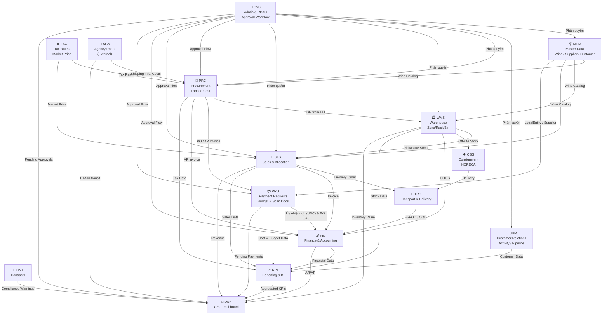

# Database ERD — Wine ERP System
**Phase 3 — Architecture Design** | 2026-03-04 | Updated 2026-09-24

> ERD này thể hiện toàn bộ mô hình dữ liệu của 30 module (132 models, 85 enums). Được phân thành 3 phần:
> 1. Sơ đồ phụ thuộc giữa các Domain (Module Map)
> 2. ERD tổng hợp các Entity cốt lõi (Core ERD)
> 3. Schema chi tiết từng Domain

---

## 1. Sơ Đồ Phụ Thuộc Module (Module Dependency Map)


```mermaid
graph TB
    SYS["🔐 SYS\nAdmin & RBAC\nApproval Workflow"]
    MDM["📦 MDM\nMaster Data\nWine / Supplier / Customer"]
    CRM["🤝 CRM\nCustomer Relations\nActivity / Pipeline"]
    CNT["📑 CNT\nContracts"]
    TAX["📊 TAX\nTax Rates\nMarket Price"]
    PRC["🚢 PRC\nProcurement\nLanded Cost"]
    AGN["🏢 AGN\nAgency Portal\n(External)"]
    WMS["🏭 WMS\nWarehouse\nZone/Rack/Bin"]
    SLS["💼 SLS\nSales & Allocation"]
    CSG["🍽️ CSG\nConsignment\nHORECA"]
    TRS["🚚 TRS\nTransport & Delivery"]
    FIN["💰 FIN\nFinance & Accounting"]
    PRQ["💳 PRQ\nPayment Requests\nBudget & Scan Docs"]
    RPT["📈 RPT\nReporting & BI"]
    DSH["👑 DSH\nCEO Dashboard"]

    SYS -->|"Phân quyền"| MDM
    SYS -->|"Phân quyền"| CRM
    SYS -->|"Phân quyền"| PRC
    SYS -->|"Phân quyền"| WMS
    SYS -->|"Phân quyền"| SLS
    SYS -->|"Approval Flow"| PRC
    SYS -->|"Approval Flow"| SLS
    SYS -->|"Approval Flow"| FIN
    SYS -->|"Approval Flow"| PRQ

    MDM -->|"Wine Catalog"| PRC
    MDM -->|"Wine Catalog"| WMS
    MDM -->|"Wine Catalog"| SLS
    MDM -->|"LegalEntity / Supplier"| PRQ
    TAX -->|"Tax Rates"| PRC
    TAX -->|"Market Price"| SLS

    AGN -->|"Shipping Info, Costs"| PRC
    PRC -->|"GR from PO"| WMS
    PRC -->|"PO / AP Invoice"| PRQ
    WMS -->|"Pick/Issue Stock"| SLS
    WMS -->|"Off-site Stock"| CSG
    SLS -->|"Delivery Order"| TRS
    CSG -->|"Delivery"| TRS
    TRS -->|"E-POD / COD"| FIN
    SLS -->|"Invoice"| FIN
    PRC -->|"AP Invoice"| FIN
    WMS -->|"COGS"| FIN
    PRQ -->|"Ủy nhiệm chi (UNC) & Bút toán"| FIN

    FIN -->|"Financial Data"| RPT
    PRQ -->|"Cost & Budget Data"| RPT
    SLS -->|"Sales Data"| RPT
    WMS -->|"Stock Data"| RPT
    PRC -->|"Tax Data"| RPT
    CRM -->|"Customer Data"| RPT

    RPT -->|"Aggregated KPIs"| DSH
    SYS -->|"Pending Approvals"| DSH
    WMS -->|"Inventory Value"| DSH
    SLS -->|"Revenue"| DSH
    AGN -->|"ETA In-transit"| DSH
    FIN -->|"AR/AP"| DSH
    PRQ -->|"Pending Payments"| DSH
    CNT -->|"Compliance Warnings"| DSH
```

---

## 2. ERD Cốt Lõi (Core Entity Relationship Diagram)

> Mermaid ERD — Các Entity quan trọng nhất và mối quan hệ giữa chúng.

```mermaid
erDiagram
    %% ── SYS DOMAIN ──────────────────────────────────────────
    User {
        id          uuid PK
        email       string
        name        string
        dept_id     uuid FK
        status      enum
    }
    Department {
        id          uuid PK
        name        string
        parent_id   uuid FK
    }
    Role {
        id          uuid PK
        name        string
        dept_id     uuid FK
    }
    LegalEntity {
        id          uuid PK
        code        string UK
        name        string
        tax_id      string
    }
    ApprovalRequest {
        id          uuid PK
        doc_type    enum
        doc_id      uuid
        step        int
        status      enum
        requested_by uuid FK
    }

    %% ── MDM DOMAIN ──────────────────────────────────────────
    Product {
        id              uuid PK
        sku_code        string
        product_name    string
        producer_id     uuid FK
        appellation_id  uuid FK
        country         string
        abv_percent     decimal
        volume_ml       int
        packaging_type  enum
        units_per_case  int
        hs_code         string
        barcode_ean     string
        wine_type       enum
        is_allocation   boolean
        status          enum
        self_declaration_url string
        tasting_note_url string
    }
    Producer {
        id      uuid PK
        name    string
        country string
        region  string
    }
    Appellation {
        id          uuid PK
        name        string
        region      string
        country     string
    }
    ProductMedia {
        id          uuid PK
        product_id  uuid FK
        media_type  enum
        url         string
        is_primary  boolean
    }
    ProductAward {
        id          uuid PK
        product_id  uuid FK
        vintage     int
        source      string
        score       decimal
        medal       enum
    }
    PriceList {
        id              uuid PK
        name            string
        channel         enum
        effective_date  date
        expiry_date     date
    }
    PriceListLine {
        id          uuid PK
        pricelist_id uuid FK
        product_id  uuid FK
        unit_price  decimal
        currency    string
    }
    Supplier {
        id              uuid PK
        code            string
        name            string
        type            enum
        country         string
        trade_agreement string
        co_form         string
        payment_term    string
        default_currency string
        incoterms       string
        lead_time_days  int
        status          enum
    }
    Customer {
        id              uuid PK
        code            string
        name            string
        tax_id          string
        customer_type   enum
        channel         enum
        base_price_type string
        default_discount_pct decimal
        payment_term    string
        credit_limit    decimal
        sales_rep_id    uuid FK
        status          enum
    }
    CustomerAddress {
        id          uuid PK
        customer_id uuid FK
        label       string
        address     string
        is_billing  boolean
        is_default  boolean
    }
    CustomerProductCode {
        id            string PK
        customer_id   uuid FK
        product_id    uuid FK
        customer_code string
        notes         text
    }

    %% ── CRM DOMAIN ──────────────────────────────────────────
    CustomerActivity {
        id          uuid PK
        customer_id uuid FK
        type        enum
        description text
        performed_by uuid FK
        occurred_at datetime
    }
    SalesOpportunity {
        id              uuid PK
        customer_id     uuid FK
        name            string
        expected_value  decimal
        stage           enum
        probability     int
        assigned_to     uuid FK
        close_date      date
    }
    ComplaintTicket {
        id          uuid PK
        customer_id uuid FK
        so_id       uuid FK
        type        enum
        severity    enum
        status      enum
        resolution  text
    }
    SalesCallLog {
        id              uuid PK
        salesperson_id  uuid FK
        channel         enum
        customer_id     uuid FK_nullable
        prospect_name   string
        prospect_company string
        phone           string
        call_type       string
        outcome         string
        notes           text
        follow_up_date  datetime
        called_at       datetime
    }
    SalesCallPlan {
        id              uuid PK
        salesperson_id  uuid FK
        assigned_by_id  uuid FK_nullable
        plan_date       date
        channel         enum
        customer_id     uuid FK_nullable
        prospect_name   string
        prospect_company string
        phone           string
        call_type       string
        priority        string
        status          string
        notes           text
        scheduled_time  string
        call_log_id     uuid FK_nullable
        completed_at    datetime
    }

    %% ── CNT DOMAIN ──────────────────────────────────────────
    Contract {
        id              uuid PK
        contract_no     string
        type            enum
        supplier_id     uuid FK
        customer_id     uuid FK
        value           decimal
        currency        string
        payment_term    string
        incoterms       string
        start_date      date
        end_date        date
        status          enum
    }

    %% ── TAX DOMAIN ──────────────────────────────────────────
    TaxRate {
        id                  uuid PK
        hs_code             string
        country_of_origin   string
        trade_agreement     string
        import_tax_rate     decimal
        sct_rate            decimal
        vat_rate            decimal
        effective_date      date
        expiry_date         date
        requires_co         boolean
        co_form_type        string
    }
    MarketPrice {
        id          uuid PK
        product_id  uuid FK
        price       decimal
        currency    string
        source      string
        price_date  date
        entered_by  uuid FK
    }

    %% ── PRC DOMAIN ──────────────────────────────────────────
    PurchaseOrder {
        id              uuid PK
        po_no           string
        legal_entity_id uuid FK
        supplier_id     uuid FK
        contract_id     uuid FK
        currency        string
        exchange_rate   decimal
        status          enum
        subtotal        decimal "Tiền hàng trước giảm"
        discount_pct    decimal "% Giảm giá trên đơn hàng"
        discount_amount decimal "Số tiền giảm cụ thể"
        total_amount    decimal "Tổng phải thanh toán sau giảm"
        created_by      uuid FK
    }
    PurchaseOrderLine {
        id              uuid PK
        po_id           uuid FK
        product_id      uuid FK
        qty_ordered     decimal
        unit_price      decimal "Đơn giá (0.00 đối với hàng FOC)"
        uom             string
        is_foc          boolean "Cờ hàng tặng FOC (Free of Charge)"
        foc_note        string "Lý do / mục đích FOC (nếm thử, thưởng...)"
        declared_price  decimal "Giá danh nghĩa khai báo HQ & tính thuế NK/TTĐB"
    }
    Shipment {
        id                  uuid PK
        bill_of_lading      string
        po_id               uuid FK
        vessel_name         string
        port_of_loading     string
        port_of_discharge   string
        eta                 datetime
        cif_amount          decimal
        currency            string
        status              enum
    }
    LandedCostCampaign {
        id              uuid PK
        shipment_id     uuid FK
        total_import_tax decimal
        total_sct       decimal
        total_vat       decimal
        total_other_cost decimal
        status          enum
    }
    LandedCostAllocation {
        id              uuid PK
        campaign_id     uuid FK
        product_id      uuid FK
        qty             decimal
        unit_landed_cost decimal
    }

    %% ── WMS DOMAIN ──────────────────────────────────────────
    Warehouse {
        id          uuid PK
        code        string
        name        string
        address     string
        type        enum "INTERNAL | CONSIGNMENT"
        customer_id uuid FK "Customer receiving consignment"
    }
    Location {
        id              uuid PK
        warehouse_id    uuid FK
        zone            string
        rack            string
        bin             string
        location_code   string
        type            enum
        capacity_cases  int
    }
    StockLot {
        id              uuid PK
        lot_no          string
        owner_entity_id uuid FK
        product_id      uuid FK
        shipment_id     uuid FK
        location_id     uuid FK
        qty_received    decimal
        qty_available   decimal
        unit_landed_cost decimal
        received_date   date
        vintage         int
        status          enum
    }
    GoodsReceipt {
        id          uuid PK
        gr_no       string
        po_id       uuid FK
        warehouse_id uuid FK
        status      enum
        confirmed_by uuid FK
        confirmed_at datetime
    }
    GoodsReceiptLine {
        id              uuid PK
        gr_id           uuid FK
        product_id      uuid FK
        lot_id          uuid FK
        qty_expected    decimal
        qty_received    decimal
        variance        decimal
    }
    DeliveryOrder {
        id          uuid PK
        do_no       string
        so_id       uuid FK
        warehouse_id uuid FK
        status      enum
    }
    DeliveryOrderLine {
        id          uuid PK
        do_id       uuid FK
        product_id  uuid FK
        lot_id      uuid FK
        location_id uuid FK
        qty_picked  decimal
        qty_shipped decimal
    }
    StockCountSession {
        id              uuid PK
        session_no      string
        warehouse_id    uuid FK
        type            enum
        scope_type      enum
        is_blind_count  boolean
        status          enum
    }
    StockCountLine {
        id              uuid PK
        session_id      uuid FK
        product_id      uuid FK
        vintage         int
        location_id     uuid FK
        qty_system      decimal
        qty_actual      decimal
        variance        decimal
    }
    PosmProduct {
        id              uuid PK
        posm_code       string
        name            string
        category        enum
        unit            string
        brand           string
        cost_price      decimal
        qty_on_hand     decimal
        min_stock_alert decimal
        location        string
        status          string
    }
    PosmTransaction {
        id              uuid PK
        doc_no          string
        type            enum
        reason          enum
        posm_product_id uuid FK
        qty             decimal
        unit_cost       decimal
        total_cost      decimal
        recipient       string
        requested_by    string
        performed_at    datetime
    }

    %% ── SLS DOMAIN ──────────────────────────────────────────
    SalesOrder {
        id                  uuid PK
        so_no               string
        legal_entity_id     uuid FK
        customer_id         uuid FK
        contract_id         uuid FK
        sales_rep_id        uuid FK
        channel             enum
        shipping_address_id uuid FK
        payment_term        string
        status              enum
        total_amount        decimal
        is_invoice_exempt   boolean
        invoice_exempt_reason string
        invoice_exempt_by   string
        invoice_exempt_at   datetime
    }
    SalesOrderLine {
        id                      uuid PK
        so_id                   uuid FK
        product_id              uuid FK
        qty_ordered             decimal
        unit_price              decimal
        line_discount_pct       decimal
        allocation_campaign_id  uuid FK
    }
    AllocationCampaign {
        id          uuid PK
        name        string
        product_id  uuid FK
        total_qty   decimal
        unit        enum
        start_date  date
        end_date    date
        status      enum
    }
    AllocationQuota {
        id          uuid PK
        campaign_id uuid FK
        target_type enum
        target_id   uuid
        qty_allocated decimal
        qty_sold    decimal
    }

    %% ── CSG DOMAIN ──────────────────────────────────────────
    ConsignmentAgreement {
        id              uuid PK
        customer_id     uuid FK
        contract_id     uuid FK
        start_date      date
        end_date        date
        report_frequency enum
        status          enum
    }
    ConsignmentStock {
        id              uuid PK
        agreement_id    uuid FK
        product_id      uuid FK
        qty_consigned   decimal
        qty_sold        decimal
        qty_remaining   decimal
    }

    %% ── TRS DOMAIN ──────────────────────────────────────────
    DeliveryRoute {
        id          uuid PK
        route_date  date
        driver_id   uuid FK
        vehicle_id  uuid FK
        status      enum
    }
    DeliveryStop {
        id              uuid PK
        route_id        uuid FK
        do_id           uuid FK
        sequence        int
        address         string
        status          enum
        pod_signed_at   datetime
        cod_amount      decimal
        cod_status      enum
    }
    ProofOfDelivery {
        id              uuid PK
        stop_id         uuid FK
        signature_url   string
        photo_url       string
        confirmed_by    string
        confirmed_at    datetime
    }

    %% ── FIN DOMAIN ──────────────────────────────────────────
    ARInvoice {
        id              uuid PK
        invoice_no      string
        legal_entity_id uuid FK
        so_id           uuid FK
        customer_id     uuid FK
        amount          decimal
        vat_amount      decimal
        due_date        date
        status          enum
    }
    ARPayment {
        id          uuid PK
        invoice_id  uuid FK
        amount      decimal
        paid_at     datetime
        method      enum
    }
    APInvoice {
        id              uuid PK
        invoice_no      string
        legal_entity_id uuid FK
        po_id           uuid FK
        supplier_id     uuid FK
        amount          decimal
        currency        string
        due_date        date
        status          enum
    }
    JournalEntry {
        id          uuid PK
        entry_no    string
        doc_type    enum
        doc_id      uuid
        period_id   uuid FK
        posted_at   datetime
        created_by  uuid FK
    }
    JournalLine {
        id          uuid PK
        entry_id    uuid FK
        account     string
        debit       decimal
        credit      decimal
        description string
    }
    AccountingPeriod {
        id          uuid PK
        year        int
        month       int
        is_closed   boolean
        closed_by   uuid FK
        closed_at   datetime
    }
    WineStampPurchase {
        id          uuid PK
        purchaseDate date
        stampType   enum
        symbol      string
        serialStart string
        serialEnd   string
        totalQty    int
        usedQty     int
        status      enum
    }
    WineStampUsage {
        id          uuid PK
        purchaseId  uuid FK
        shipmentId  uuid FK
        lotId       uuid FK
        qtyUsed     int
        qtyDamaged  int
        usedAt      datetime
        reportedBy  uuid FK
    }

    %% ── PRQ DOMAIN (Payment Requests & Expense Budgets) ───────
    ExpenseCategoryMaster {
        id                  uuid PK
        code                string UK
        name                string
        category            enum
        default_vas_account string
        description         string
        is_active           boolean
    }
    ExpenseBudget {
        id                  uuid PK
        category_id         uuid FK
        entity_id           uuid FK
        dept_id             uuid FK
        period_type         enum
        period_value        int
        year                int
        allocated_amount    decimal
        warning_threshold   decimal
    }
    PaymentRequest {
        id                  uuid PK
        request_no          string UK
        entity_id           uuid FK
        dept_id             uuid FK
        requested_by_id     uuid FK
        supplier_id         uuid FK
        po_id               uuid FK
        invoice_id          uuid FK
        proposal_id         uuid FK
        category            enum
        total_amount        decimal
        currency            string
        status              enum
        paid_amount         decimal
        bank_ref_no         string
    }
    PaymentRequestItem {
        id                  uuid PK
        request_id          uuid FK
        category_id         uuid FK
        budget_id           uuid FK
        description         string
        amount              decimal
        vat_amount          decimal
        account_code        string
    }
    PaymentRequestAttachment {
        id                  uuid PK
        request_id          uuid FK
        file_name           string
        file_url            string
        file_path           string
        doc_type            enum
        storage_bucket      string
    }
    PaymentApprovalLog {
        id                  uuid PK
        request_id          uuid FK
        actor_id            uuid FK
        action              string
        from_status         enum
        to_status           enum
        comments            string
    }

    %% ── RELATIONSHIPS ────────────────────────────────────────

    %% MDM
    Product }o--|| Producer : "sản xuất bởi"
    Product }o--o| Appellation : "có nhãn"
    Product ||--o{ ProductMedia : "có ảnh"
    Product ||--o{ ProductAward : "có giải"
    PriceList ||--o{ PriceListLine : "bao gồm"
    PriceListLine }o--|| Product : "định giá"
    Customer ||--o{ CustomerAddress : "có địa chỉ"
    Customer }o--|| User : "phụ trách bởi"

    %% CRM
    Customer ||--o{ CustomerActivity : "có hoạt động"
    Customer ||--o{ SalesOpportunity : "có cơ hội"
    Customer ||--o{ ComplaintTicket : "có khiếu nại"
    Customer ||--o{ SalesCallLog : "có cuộc gọi"
    CustomerActivity }o--|| User : "thực hiện bởi"
    SalesCallLog }o--|| User : "thực hiện bởi"

    %% CNT
    Contract }o--o| Supplier : "với NCC"
    Contract }o--o| Customer : "với KH"
    RegulatedDocument ||--o{ RegDocFile : "có file"
    RegulatedDocument ||--o{ RegDocAlert : "có cảnh báo"
    RegulatedDocument }o--o| Supplier : "scope=NCC"
    RegulatedDocument }o--o| Customer : "scope=KH"
    RegulatedDocument }o--o| Product : "scope=SP"
    RegulatedDocument }o--o| Shipment : "scope=Shipment"
    RegulatedDocument }o--o| StockLot : "scope=Lot"
    RegulatedDocument }o--o| Contract : "gắn HĐ"

    RegulatedDocument {
        id              uuid PK
        doc_no          string UK
        category        enum
        type            enum
        name            string
        scope           enum
        issue_date      date
        expiry_date     date
        issuing_authority string
        status          enum
        version         int
        alert_days      int_array
        supplier_id     uuid FK
        customer_id     uuid FK
        product_id      uuid FK
        shipment_id     uuid FK
        stock_lot_id    uuid FK
        contract_id     uuid FK
        renewed_from_id uuid FK
    }
    RegDocFile {
        id              uuid PK
        reg_doc_id      uuid FK
        name            string
        file_url        string
        version         int
    }
    RegDocAlert {
        id              uuid PK
        reg_doc_id      uuid FK
        alert_type      string
        scheduled_at    datetime
        sent_at         datetime
    }

    %% TAX
    MarketPrice }o--|| Product : "giá của"

    %% PRC
    PurchaseOrder }o--|| Supplier : "đặt hàng NCC"
    PurchaseOrder }o--o| Contract : "dưới HĐ"
    PurchaseOrder ||--o{ PurchaseOrderLine : "bao gồm"
    PurchaseOrderLine }o--|| Product : "mặt hàng"
    Shipment }o--|| PurchaseOrder : "giao từ PO"
    LandedCostCampaign ||--|| Shipment : "tính cost cho"
    LandedCostCampaign ||--o{ LandedCostAllocation : "phân bổ xuống"
    LandedCostAllocation }o--|| Product : "per mặt hàng"

    %% WMS
    Warehouse ||--o{ Location : "có vị trí"
    StockLot }o--|| Product : "loại sản phẩm"
    StockLot }o--o| Shipment : "từ lô hàng"
    StockLot }o--|| Location : "tại vị trí"
    GoodsReceipt }o--|| PurchaseOrder : "nhập từ PO"
    GoodsReceipt }o--|| Warehouse : "nhập vào kho"
    GoodsReceipt ||--o{ GoodsReceiptLine : "gồm các dòng"
    GoodsReceiptLine }o--|| Product : "sản phẩm"
    GoodsReceiptLine }o--o| StockLot : "tạo lô"
    DeliveryOrder }o--|| SalesOrder : "xuất theo SO"
    DeliveryOrder }o--|| Warehouse : "từ kho"
    DeliveryOrder ||--o{ DeliveryOrderLine : "gồm các dòng"
    DeliveryOrderLine }o--|| Product : "sản phẩm"
    DeliveryOrderLine }o--|| StockLot : "lấy từ lô"
    DeliveryOrderLine }o--|| Location : "tại ô kệ"

    %% SLS
    SalesOrder }o--|| Customer : "của KH"
    SalesOrder }o--o| Contract : "dưới HĐ"
    SalesOrder }o--|| User : "do Sales Rep"
    SalesOrder ||--o{ SalesOrderLine : "bao gồm"
    SalesOrderLine }o--|| Product : "mặt hàng"
    SalesOrderLine }o--o| AllocationCampaign : "thuộc Allocation"
    AllocationCampaign }o--|| Product : "cho SKU"
    AllocationCampaign ||--o{ AllocationQuota : "phân bổ"
    ComplaintTicket }o--o| SalesOrder : "từ đơn bán"

    %% CSG
    ConsignmentAgreement }o--|| Customer : "với KH HORECA"
    ConsignmentAgreement }o--o| Contract : "theo HĐ"
    ConsignmentAgreement ||--o{ ConsignmentStock : "tồn ký gửi"
    ConsignmentStock }o--|| Product : "mặt hàng"

    %% TRS
    DeliveryRoute ||--o{ DeliveryStop : "gồm các điểm"
    DeliveryStop }o--|| DeliveryOrder : "giao cho DO"
    DeliveryStop ||--o| ProofOfDelivery : "có E-POD"

    %% FIN
    ARInvoice }o--|| SalesOrder : "từ đơn bán"
    ARInvoice }o--|| Customer : "của KH"
    ARInvoice ||--o{ ARPayment : "có thanh toán"
    APInvoice }o--|| PurchaseOrder : "từ đơn mua"
    APInvoice }o--|| Supplier : "của NCC"
    JournalEntry ||--o{ JournalLine : "bao gồm bút toán"
    JournalEntry }o--|| AccountingPeriod : "thuộc kỳ KT"
    WineStampPurchase ||--o{ WineStampUsage : "có lịch sử sử dụng"
    WineStampUsage }o--o| Shipment : "dán cho lô hàng"
    WineStampUsage }o--o| StockLot : "dán cho lô tồn kho"

    %% PRQ
    PaymentRequest }o--|| LegalEntity : "pháp nhân chi"
    PaymentRequest }o--o| Department : "phòng ban"
    PaymentRequest }o--|| User : "người lập"
    PaymentRequest }o--o| Supplier : "nhà cung cấp"
    PaymentRequest }o--o| PurchaseOrder : "theo PO"
    PaymentRequest }o--o| APInvoice : "theo hóa đơn AP"
    PaymentRequest }o--o| Proposal : "theo tờ trình"
    PaymentRequest ||--o{ PaymentRequestItem : "chi tiết dòng"
    PaymentRequestItem }o--o| ExpenseCategoryMaster : "hạng mục chi phí"
    PaymentRequestItem }o--o| ExpenseBudget : "ngân sách dự toán"
    PaymentRequest ||--o{ PaymentRequestAttachment : "chứng từ đính kèm"
    PaymentRequest ||--o{ PaymentApprovalLog : "lịch sử duyệt"

    %% SYS
    ApprovalRequest }o--|| User : "yêu cầu bởi"
    User }o--|| Department : "thuộc phòng ban"
```

---

## 3. Database Domain Schemas (Prisma-style — Per Module)

> Chi tiết đầy đủ các trường của từng bảng. Đây là input để Developer viết `schema.prisma`.

Xem chi tiết tại: [`database-domain-schemas.md`](./database-domain-schemas.md)

---

## 4. Ghi Chú Thiết Kế Quan Trọng

### A. Quy Tắc Đặt Tên
- **PK:** Mọi bảng dùng `id uuid DEFAULT gen_random_uuid()`
- **FK:** Tên trường `{table_name}_id` (ví dụ: `customer_id`, `product_id`)
- **Timestamp:** Mọi bảng có `created_at`, `updated_at` (auto-managed by Prisma)
- **Soft Delete:** Các entity quan trọng (Product, Customer, Supplier) dùng `deleted_at` nullable thay vì xóa thật

### B. Multi-tenancy (Tương Lai)
- Cột `company_id` sẽ được thêm vào tất cả bảng khi cần mở rộng Multi-tenant (Chạy ERP cho nhiều công ty trên cùng 1 hệ thống)

### C. Enum Values Quan Trọng

| Enum | Values |
|---|---|
| `user.status` | ACTIVE, INACTIVE, SUSPENDED |
| `product.status` | ACTIVE, DISCONTINUED, ALLOCATION_ONLY |
| `product.wine_type` | RED, WHITE, ROSE, SPARKLING, FORTIFIED, DESSERT |
| `product.packaging_type` | OWC, CARTON |
| `supplier.type` | WINERY, NEGOCIANT, DISTRIBUTOR, LOGISTICS, FORWARDER, CUSTOMS_BROKER |
| `customer.customer_type` | HORECA, WHOLESALE_DISTRIBUTOR, VIP_RETAIL, INDIVIDUAL |
| `po.status` | DRAFT, PENDING_APPROVAL, APPROVED, IN_TRANSIT, PARTIALLY_RECEIVED, RECEIVED, CANCELLED |
| `so.status` | DRAFT, PENDING_APPROVAL, CONFIRMED, PARTIALLY_DELIVERED, DELIVERED, INVOICED, PAID, CANCELLED |
| `stocklot.status` | AVAILABLE, RESERVED, QUARANTINE, CONSUMED |
| `contract.type` | PURCHASE, SALES, CONSIGNMENT, LOGISTICS, WAREHOUSE_RENTAL |
| `location.type` | STORAGE, RECEIVING, SHIPPING, QUARANTINE, VIRTUAL |
| `mediatype` | PRODUCT_MAIN, LABEL_FRONT, LABEL_BACK, LIFESTYLE, GROUP, OWC_CASE, AWARD, WINERY |
| `doc_type (approval)` | PURCHASE_ORDER, SALES_ORDER, WRITE_OFF, DISCOUNT_OVERRIDE, TAX_DECLARATION |
| `journal_entry doc_type` | GOODS_RECEIPT, GOODS_ISSUE, SALES_INVOICE, PURCHASE_INVOICE, PAYMENT_IN, PAYMENT_OUT, ADJUSTMENT |
| `reg_doc.category` | COMPANY_LICENSE, IMPORT_DOCUMENT, PRODUCT_CERTIFICATION, FACILITY_COMPLIANCE, TRADE_AGREEMENT |
| `reg_doc.type` | 27 loại: DISTRIBUTION_LICENSE, FIRE_SAFETY_CERT, CERTIFICATE_OF_ORIGIN... (xem đặc tả CNT) |
| `reg_doc.scope` | COMPANY, SUPPLIER, CUSTOMER, PRODUCT, SHIPMENT, LOT |
| `reg_doc.status` | ACTIVE, EXPIRING, EXPIRED, REVOKED, RENEWAL_PENDING, DRAFT |
| `proposal` | `startDate`, `endDate` (Thời hạn hiệu lực ngày bắt đầu và kết thúc) |
| `ProposalCategory` (enum) | Bổ sung giá trị `INTERNAL_TRAINING` (Tờ trình đào tạo nội bộ & mẫu thử nếm) |
| `transfer_order_lines` | `vintage` (Niên vụ chọn khi lập phiếu chuyển kho) |
| `sales_visits` | `visitNo`, `customerId`, `salespersonId`, `status`, `purpose`, `activityType`, `scheduleId`, `isUnplanned`, `checkInTime`/`checkOutTime`, `checkInPhoto`/`checkOutPhoto`, `durationMinutes`, `notes` |
| `weekly_visit_plans` | `salesRepId`, `weekNumber`, `year`, `status`, `note`, `selfReview`, `managerFeedback`, `submittedAt`, `reviewedAt` |
| `sales_visit_schedules` | `planId`, `customerId`, `visitDate`, `purpose`, `status`, `isUnplanned`, `salesVisitId`, `resultNotes` |
| `sales_orders` | `isInvoiceExempt`, `invoiceExemptReason`, `invoiceExemptBy`, `invoiceExemptAt` (Nghiệp vụ miễn xuất HĐ VAT, bảo toàn đủ 100% VAT và doanh thu) |
| `employees` | `code`, `userId`, `fullName`, `gender`, `dateOfBirth`, `phone`, `email`, `nationalId`, `address`, `emergencyContact`, `deptId`, `position`, `status`, `contractType`, `contractEndDate`, `bankAccountNo`, `taxCode`, `socialInsuranceNo`, `healthCheckExpiry` |
| `employee_documents` | `employeeId`, `docType`, `title`, `docNumber`, `fileUrl`, `filePath`, `issueDate`, `expiryDate`, `status`, `uploadedBy` |
| `posm_products` | `posmCode`, `name`, `category` (PosmCategory), `unit`, `brand`, `imageUrl`, `costPrice`, `qtyOnHand`, `minStockAlert`, `location`, `status`, `notes` |
| `posm_transactions` | `docNo`, `type` (PosmTxType), `reason` (PosmReason), `posmProductId`, `qty`, `unitCost`, `totalCost`, `recipient`, `requestedBy`, `performedAt`, `notes` |
| `PosmCategory` (enum) | `GLASSWARE_TOOLS`, `DISPLAY_STAND`, `PACKAGING_GIFT`, `MARKETING_COLLATERAL`, `OTHER` |
| `PosmTxType` (enum) | `INBOUND`, `OUTBOUND`, `ADJUSTMENT` |
| `PosmReason` (enum) | `PURCHASE_INBOUND`, `SUPPLIER_SPONSOR`, `EVENT_RETURN`, `SALES_ALLOCATION`, `HORECA_PLACEMENT`, `PROMO_GIFT`, `EVENT_WORKSHOP`, `DAMAGE_LOSS`, `INVENTORY_ADJUST`, `OTHER` |
| `PaymentCategory` (enum) | `SUPPLIER_PAYMENT`, `CUSTOMS_TAX`, `LOGISTICS_SHIPPING`, `MARKETING_EVENT`, `OFFICE_ADMIN`, `SALARY_BENEFITS`, `CAPEX_EQUIPMENT`, `ADVANCE_REQUEST`, `OTHER` |
| `PaymentRequestStatus` (enum) | `DRAFT`, `SUBMITTED`, `DEPT_APPROVED`, `ACCT_APPROVED`, `CEO_APPROVED`, `REJECTED`, `PAID`, `CANCELLED` |
| `PaymentDocType` (enum) | `VAT_INVOICE`, `COMMERCIAL_CONTRACT`, `DELIVERY_NOTE_BL`, `PROPOSAL_SHEET`, `CUSTOMS_DECLARATION`, `QUOTATION_COMPARE`, `PAYMENT_ORDER_UNC`, `EXPENSE_RECEIPT`, `OTHER` |
| `BudgetPeriodType` (enum) | `MONTH`, `QUARTER`, `YEAR` |
| `expense_category_masters` | `code`, `name`, `category`, `defaultVasAccount`, `description`, `isActive` (Hạng mục chi phí và tài khoản VAS mặc định) |
| `expense_budgets` | `categoryId`, `entityId`, `deptId`, `periodType`, `periodValue`, `year`, `allocatedAmount`, `warningThreshold` (Ngân sách dự toán chi phí) |
| `payment_requests` | `requestNo`, `entityId`, `deptId`, `requestedById`, `supplierId`, `poId`, `invoiceId`, `proposalId`, `category`, `totalAmount`, `status`, `paidAmount`, `bankRefNo`, `paymentDate` |
| `payment_request_items` | `requestId`, `categoryId`, `budgetId`, `description`, `amount`, `vatAmount`, `accountCode` |
| `payment_request_attachments` | `requestId`, `fileName`, `fileUrl`, `filePath`, `docType`, `storageBucket` (Chứng từ scan lưu R2/Supabase) |
| `payment_approval_logs` | `requestId`, `actorId`, `action`, `fromStatus`, `toStatus`, `comments` (Lịch sử phê duyệt đa cấp) |

### D. Indexes Quan Trọng
```sql
-- Tìm tồn kho theo SKU nhanh
CREATE INDEX idx_stocklot_product ON stock_lot(product_id, status);
CREATE INDEX idx_stocklot_prod_qty ON stock_lots(productId, qtyAvailable);

-- Lọc đơn hàng miễn hóa đơn VAT
CREATE INDEX sales_orders_is_invoice_exempt_idx ON sales_orders(isInvoiceExempt);

-- Tra cứu thuế
CREATE INDEX idx_taxrate_lookup ON tax_rate(hs_code, country_of_origin, effective_date);

-- Tìm kiếm SO theo KH
CREATE INDEX idx_so_customer ON sales_order(customer_id, status, created_at DESC);

-- Tổng hợp doanh thu theo tháng
CREATE INDEX idx_arinvoice_period ON ar_invoice(customer_id, status, created_at);

-- Allocation check
CREATE INDEX idx_quota_campaign ON allocation_quota(campaign_id, target_type, target_id);

-- Đề nghị thanh toán theo trạng thái & pháp nhân
CREATE INDEX payment_requests_entity_status_idx ON payment_requests(entityId, status);
CREATE INDEX payment_requests_requested_by_idx ON payment_requests(requestedById);

-- Ngân sách chi phí theo năm và kỳ
CREATE INDEX expense_budgets_lookup_idx ON expense_budgets(categoryId, entityId, year, periodType);
```
