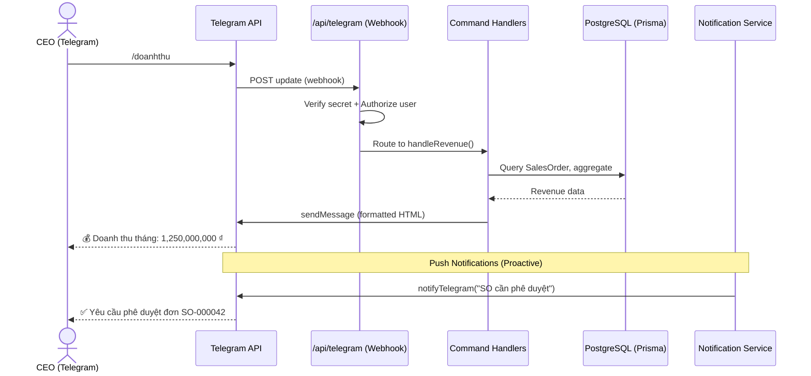

# TLG — Telegram Bot Integration
> **Module Code:** TLG  
> **Mục đích:** Kết nối Telegram Bot cho CEO — truy vấn dữ liệu ERP real-time & nhận thông báo tự động.  
> **Ngày tạo:** 06/03/2026 | **Kiến trúc:** Webhook via Next.js API Routes

---

## 1. Tổng Quan

CEO có thể truy vấn mọi thông tin hệ thống Wine ERP trực tiếp qua Telegram Bot mà không cần đăng nhập web. Bot cũng chủ động push thông báo khi có sự kiện quan trọng.

### Đặc điểm kỹ thuật
- **Kiến trúc:** Webhook-based (Telegram → `/api/telegram` → Process → Response)
- **Zero dependencies:** Sử dụng native `fetch`, không cần `node-telegram-bot-api` hay thư viện ngoài
- **Bảo mật 3 lớp:** Webhook Secret + User Whitelist + Read-only access
- **Database:** Shared Prisma Client — dùng chung schema hiện tại, không thêm bảng mới
- **Deploy:** Tương thích Vercel Serverless Functions (cold start < 500ms)

---

## 2. Kiến Trúc Tích Hợp



### Luồng dữ liệu

```
Telegram Update → POST /api/telegram
    ├── Verify: x-telegram-bot-api-secret-token === TELEGRAM_WEBHOOK_SECRET
    ├── Authorize: message.from.id ∈ TELEGRAM_ALLOWED_CHAT_IDS
    ├── Parse: extractCommand(text) → { command, args }
    ├── Route: switch(command) → handler()
    ├── Query: Prisma ORM → PostgreSQL
    ├── Format: HTML + emoji + inline keyboard
    └── Respond: callAPI('sendMessage', { chat_id, text, reply_markup })
```

---

## 3. Files Hệ Thống

| File | Đường dẫn | Vai trò | Dòng code |
|------|-----------|---------|-----------|
| **telegram.ts** | `src/lib/telegram.ts` | Core API client — sendMessage, webhook, auth, formatting | ~216 |
| **telegram-commands.ts** | `src/lib/telegram-commands.ts` | 9 command handlers — truy vấn DB, format kết quả | ~420 |
| **route.ts** | `src/app/api/telegram/route.ts` | Webhook endpoint — nhận update, verify, route | ~130 |
| **setup/route.ts** | `src/app/api/telegram/setup/route.ts` | Webhook registration — đăng ký/hủy webhook 1 lần | ~70 |
| **notifications.ts** | `src/lib/notifications.ts` | **Modified** — Thêm dual-channel Email + Telegram | ~220 |
| **Settings UI** | `src/app/dashboard/settings/telegram/` | Trang cấu hình bot: status, test, hướng dẫn | ~350 |

---

## 4. Lệnh Bot (Commands)

### 4.1 Danh sách lệnh

| Lệnh | Alias | Mô tả | Dữ liệu truy vấn |
|-------|-------|--------|-------------------|
| `/start` | — | Giới thiệu + danh sách lệnh | — |
| `/menu` | — | Menu chính (inline keyboard) | — |
| `/doanhthu` | `/revenue` | Doanh thu tháng + hôm nay + so sánh tháng trước | `SalesOrder.aggregate()` |
| `/donhang` | `/orders` | 8 đơn hàng gần nhất | `SalesOrder.findMany()` |
| `/pheduyet` | `/approvals` | Yêu cầu phê duyệt chờ xử lý + nút Duyệt/Từ chối | `ApprovalRequest.findMany()` |
| `/tonkho` | `/stock` | Tổng chai, SKU active, tồn thấp, quarantine, Top 5 | `StockLot.aggregate()` + `groupBy()` |
| `/congno` | `/debt` | Công nợ phải thu, phân tích tuổi nợ 5 bucket, Top 5 khách nợ | `ARInvoice.findMany()` |
| `/timkiem <key>` | `/search` | Tìm kiếm đa module (Products, SO, Customers) | 3 parallel queries |
| `/baocao` | `/report` | Báo cáo tổng hợp nhanh — 7 chỉ số KPI | 7 parallel queries |

### 4.2 Chi tiết lệnh `/doanhthu`

**Query:**
```typescript
Promise.all([
    prisma.salesOrder.aggregate({ // Doanh thu tháng này
        where: { status: { in: ['CONFIRMED','DELIVERED','INVOICED','PAID'] }, createdAt: { gte: from, lte: to } },
        _sum: { totalAmount: true }
    }),
    // ... tương tự cho tháng trước, hôm nay
])
```

**Output mẫu:**
```
💰 Doanh Thu — tháng 3, 2026
━━━━━━━━━━━━━━━━━━
📅 Hôm nay: 125,000,000 ₫
📊 Tháng này: 1,250,000,000 ₫
📋 Số đơn: 42

📈 So tháng trước: +12.5%
📦 Tháng trước: 1,111,111,111 ₫
━━━━━━━━━━━━━━━━━━
```

### 4.3 Chi tiết lệnh `/pheduyet` (có Quick Action)

**Tính năng đặc biệt:** Inline keyboard buttons cho phép CEO **Duyệt/Từ chối** trực tiếp trên Telegram.

**Flow:**
```
/pheduyet → Hiển thị danh sách pending
    → [✅ Duyệt SO] [❌ Từ chối SO]   ← Inline buttons
    → CEO tap "Duyệt"
    → ApprovalRequest.update({ status: 'APPROVED' })
    → SalesOrder.update({ status: 'CONFIRMED' })  (nếu SO)
    → editMessageText("✅ Đã duyệt — SO-000042")
```

### 4.4 Natural Language Search

Khi CEO gõ text bất kỳ (không phải command `/...`), bot tự động tìm kiếm đa module:

```
"Margaux 2018" → Tìm trong Products (name, SKU) + SalesOrders (soNo) + Customers (name, code)
```

---

## 5. Thông Báo Tự Động (Push Notifications)

### 5.1 Sự kiện kích hoạt

| # | Sự kiện | Trigger | Hàm gọi | Mức ưu tiên |
|---|---------|---------|----------|-------------|
| 1 | SO cần phê duyệt | `notifySOApprovalRequired()` | `sendNotification()` | 🔴 Khẩn |
| 2 | Hóa đơn quá hạn | `notifyInvoiceOverdue()` | `sendNotification()` | 🟡 Quan trọng |
| 3 | Lô hàng sắp cập cảng | `notifyShipmentArrival()` | `sendNotification()` | 🟢 Thông thường |
| 4 | Tồn kho thấp dưới ngưỡng | `notifyLowStock()` | `sendNotification()` | 🟡 Quan trọng |
| 5 | Hợp đồng sắp hết hạn | `notifyContractExpiring()` | `sendNotification()` | 🟡 Quan trọng |

### 5.2 Cơ chế dual-channel

Mỗi notification gửi **đồng thời** qua 2 kênh (Email + Telegram) sử dụng `Promise.allSettled()`:

```typescript
async function sendNotification(emailPayload, telegramMessage) {
    const results = await Promise.allSettled([
        sendEmail(emailPayload),        // Resend API
        notifyTelegram(telegramMessage), // Telegram Bot API
    ])
    return { email: results[0], telegram: results[1] }
}
```

- **Fail-safe:** Nếu 1 kênh lỗi, kênh còn lại vẫn hoạt động
- **Non-blocking:** Không ảnh hưởng business logic (catch errors silently)

### 5.3 Format tin nhắn Telegram

```
✅ Yêu cầu phê duyệt đơn hàng
━━━━━━━━━━━━━━━━━━
📋 Số SO: SO-000042
👤 Khách hàng: Sofitel Legend HCM
💰 Tổng tiền: 185,000,000 ₫
🧑‍💼 NV Bán hàng: Khánh (Sale rep)
```

---

## 6. Bảo Mật

### 6.1 Ba lớp bảo vệ

| Lớp | Cơ chế | Chi tiết |
|-----|--------|----------|
| **L1: Webhook Secret** | `x-telegram-bot-api-secret-token` header | Telegram tự gửi header này khi có `secret_token` trong `setWebhook()` |
| **L2: User Whitelist** | `TELEGRAM_ALLOWED_CHAT_IDS` env var | Chỉ Telegram IDs trong danh sách mới được phép |
| **L3: Read-only** | Queries chỉ `findMany()`, `aggregate()`, `groupBy()` | Duy nhất Approval request cho phép mutation (đã có audit log) |

### 6.2 Unauthorized Access Response

Nếu user chưa authorized gõ lệnh:
```
🔒 Truy cập bị từ chối

Bạn không có quyền sử dụng bot này. Vui lòng liên hệ admin.
Your Telegram ID: 123456789
```
→ Hiển thị Telegram ID để admin có thể thêm vào whitelist nếu cần.

### 6.3 Webhook Setup Protection

Endpoint `/api/telegram/setup` được bảo vệ bởi `TELEGRAM_SETUP_SECRET` query param. Chỉ admin biết secret mới gọi được.

---

## 7. Cấu Hình (Environment Variables)

| Biến | Bắt buộc | Mô tả | Ví dụ |
|------|----------|-------|-------|
| `TELEGRAM_BOT_TOKEN` | ✅ | Token từ @BotFather | `123456:ABC-DEF1234ghIkl-zyx57W2v1u123ew11` |
| `TELEGRAM_WEBHOOK_SECRET` | ✅ | Secret verify webhook | `lyscellars-webhook-secret-2026` |
| `TELEGRAM_CEO_CHAT_ID` | ✅ | Telegram user ID của CEO | `987654321` |
| `TELEGRAM_ALLOWED_CHAT_IDS` | Nên | Danh sách IDs phép (comma-sep) | `987654321,111222333` |
| `TELEGRAM_SETUP_SECRET` | Nên | Secret bảo vệ endpoint setup | `lyscellars-setup-2026` |

---

## 8. Hướng Dẫn Cài Đặt

### 8.1 Tạo Bot

1. Mở Telegram → Tìm **@BotFather** → `/newbot`
2. Đặt tên bot: `LYs Cellars ERP Bot`
3. Đặt username: `lyscellars_erp_bot`
4. Copy **BOT_TOKEN** → Dán vào `.env.local`

### 8.2 Cấu hình biến môi trường

```env
TELEGRAM_BOT_TOKEN=your_bot_token
TELEGRAM_WEBHOOK_SECRET=random_secret_string
TELEGRAM_CEO_CHAT_ID=your_telegram_user_id
TELEGRAM_ALLOWED_CHAT_IDS=your_telegram_user_id
TELEGRAM_SETUP_SECRET=lyscellars-setup-2026
```

### 8.3 Lấy Telegram User ID

1. Mở bot vừa tạo trên Telegram
2. Gõ `/start` → Bot sẽ phản hồi `Your Telegram ID: XXXXXXX`
3. Copy ID → Cập nhật `TELEGRAM_CEO_CHAT_ID` và `TELEGRAM_ALLOWED_CHAT_IDS`

### 8.4 Đăng ký Webhook

**Production (Vercel):**
```
https://your-domain.vercel.app/api/telegram/setup?action=register&secret=lyscellars-setup-2026
```

**Local Development (cần ngrok):**
```bash
ngrok http 3000
# Copy https URL → 
# https://xxxx.ngrok-free.app/api/telegram/setup?action=register&secret=lyscellars-setup-2026
```

### 8.5 Kiểm tra

```
/api/telegram/setup?action=info&secret=lyscellars-setup-2026
```
→ Trả về trạng thái webhook hiện tại (URL, pending updates, last error).

---

## 9. Settings UI

**Route:** `/dashboard/settings/telegram`

### Giao diện bao gồm:

1. **Status Cards (3 cards):**
   - BOT TOKEN: 🟢 Đã cấu hình / ❌ Chưa cấu hình
   - WEBHOOK: 🟢 Đã kích hoạt / 🟡 Chưa kích hoạt
   - CEO CHAT ID: Hiển thị ID hoặc trạng thái

2. **Danh sách lệnh Bot:** 9 cards với icon + mô tả

3. **Thông báo tự động:** 5 sự kiện push với trạng thái Bật/Tắt

4. **Hành động:**
   - 🧪 Gửi test notification
   - Kết quả hiển thị inline

5. **Hướng dẫn cài đặt:** Step-by-step (5 bước) với code snippets

**Truy cập:** Từ Settings → Nút "🤖 Telegram Bot" ở header

---

## 10. Error Handling

| Tình huống | Xử lý |
|------------|-------|
| Bot token chưa cấu hình | Mock mode — log ra console, return `{ ok: true }` |
| CEO Chat ID chưa set | `notifyTelegram()` chỉ log, không gửi |
| Telegram API lỗi | Log error, trả `{ success: false, error }`, không throw |
| Webhook nhận JSON invalid | Return 400 |
| Webhook secret không khớp | Return 403 |
| User không authorized | Gửi thông báo từ chối + hiển thị Telegram ID |
| Command handler exception | Catch + gửi "⚠️ Hệ thống đang gặp lỗi..." + return 200 |
| Database query lỗi | Catch + thông báo lỗi cho user, always return 200 to Telegram |

> **Quan trọng:** Luôn return HTTP 200 cho Telegram để tránh retry loop.

---

## 11. Giới Hạn & Lưu Ý

- **Rate limit Telegram:** 30 msg/giây per bot (đủ cho use case CEO)
- **Message length:** Tối đa 4096 ký tự per tin nhắn (đã format gọn)
- **Inline keyboard:** Tối đa 100 buttons per message
- **Webhook timeout:** Telegram timeout sau 60s — các query DB phải < 10s
- **Cold start Vercel:** Function cold start ~300-500ms — acceptable
- **Không hỗ trợ file upload:** Chỉ text + inline keyboard (phù hợp CEO use case)

---

*Module Code: TLG | Created: 06/03/2026 | Author: Wine ERP Dev Team*  
*Architecture: Webhook → Next.js API Route → Prisma → PostgreSQL*
